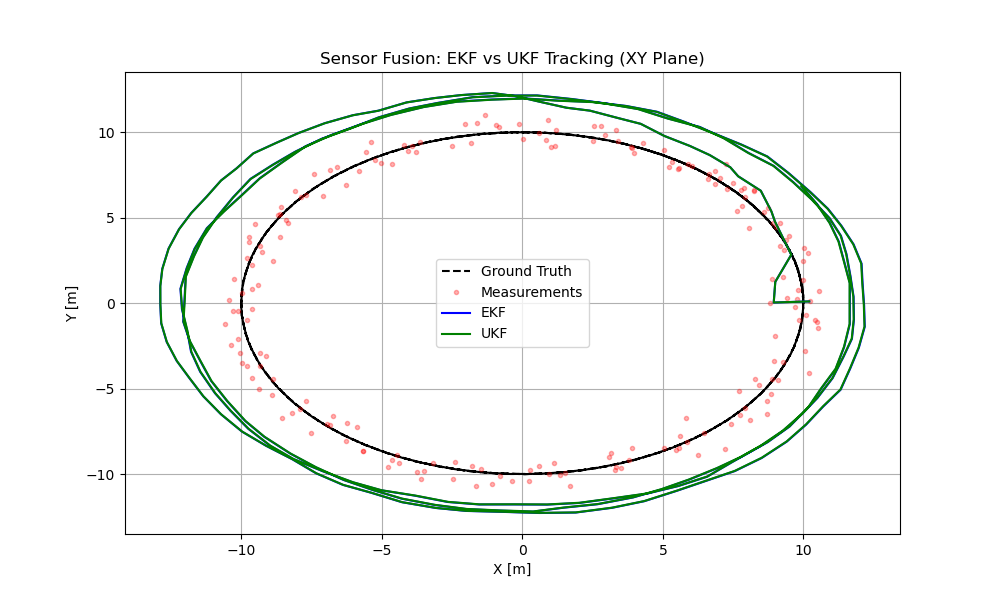

# Sensor Fusion & Calibration – Camera, LiDAR, and IMU Alignment


## 📌 Objective & Overview
This repository implements a complete, **production-grade Sensor Fusion and Calibration pipeline**. It demonstrates the fusion of heterogeneous sensor data—specifically monocular **Camera**, **LiDAR**, and **IMU**—into a unified 3D perception system.

The project addresses core challenges in robotics and autonomous systems:
- **Intrinsic & Extrinsic Calibration**: Recovering sensor parameters and rigid-body transformations.
- **Data Fusion**: Combining dense 3D point clouds with high-resolution 2D imagery.
- **State Estimation**: Implementing **Extended Kalman Filters (EKF)** and **Unscented Kalman Filters (UKF)** for robust trajectory tracking.
- **Drift Compensation**: Mitigating environmental effects on sensor alignment.

This codebase is designed to be modular, educational, and immediately runnable with **synthetic data generation** tools included.

---

## 📂 Directory Structure

| Directory | Description |
|-----------|-------------|
| `data/` | Contains sensor data (synthetic or real). |
| `data/camera/` | Raw images and intrinsic parameter files. |
| `data/lidar/` | Point cloud measurement files (.pcd). |
| `calibration/` | Scripts for sensor calibration (Intrinsic, Extrinsic, NUC). |
| `transformations/` | Core math libraries for boolean SE(3) transforms and projections. |
| `fusion/` | Fusion algorithms (EKF, UKF, Projection logic). |
| `visualization/` | Tools for visualizing fusion results and tracking error. |
| `scripts/` | Helper scripts, including synthetic data generation. |
| `docs/` | Detailed theoretical documentation. |
| `outputs/` | Generated results, plots, and logs. |

---

## 🚀 Installation

1. **Clone the repository:**
   ```bash
   git clone https://github.com/F-Karakaya/Sensor-Fusion-Calibration.git
   cd Sensor-Fusion-Calibration
   ```

2. **Install Dependencies:**
   Ensure you have Python installed, then run:
   ```bash
   pip install -r requirements.txt
   ```

   **Key Libraries:** `numpy`, `opencv-python`, `open3d`, `filterpy`, `scipy`, `matplotlib`.

---

## 🛠️ Usage Pipeline

### 1. Generate Synthetic Data
To test the pipeline without external datasets, generate synthetic sensor data:
```bash
python scripts/generate_synthetic_data.py
```
*Outputs: `data/camera/images/*.png`, `data/lidar/pointclouds/*.pcd`, `data/imu/imu_log.csv`.*

### 2. Camera Calibration (Intrinsic)
Detect checkerboard corners and compute the camera matrix ($K$) and distortion coefficients ($D$):
```bash
python calibration/camera_calibration.py
```
*Output: `data/camera/intrinsics_calibrated.yaml`.*

### 3. LiDAR-Camera Extrinsic Calibration
Compute the rigid body transform ($R, t$) aligning the LiDAR frame to the Camera frame (PnP approach):
```bash
python calibration/lidar_camera_extrinsic.py
```
*Output: `outputs/calibration_results/extrinsic_matrix.npy`.*

### 4. Sensor Fusion
Project 3D LiDAR points onto the camera image (Depth Overlay) and colorize the Point Cloud (RGB Integration):
```bash
python fusion/camera_lidar_fusion.py
```
*Outputs: `outputs/fusion_results/fused_frame.png`, `outputs/fusion_results/colored_pointcloud.pcd`.*

### 5. State Estimation (EKF/UKF)
Run the Kalman Filters to estimate the reliability of tracking 3D trajectories:
```bash
python visualization/plot_states.py
```
*Outputs: `outputs/filter_results/ekf_vs_gt.png`, `outputs/filter_results/ukf_vs_gt.png`.*

---

## 📊 Results & Visualization

### 📈 Kalman Filter Performance
Comparison of Extended Kalman Filter (EKF) and Unscented Kalman Filter (UKF) against Ground Truth.


*(Top: 2D Trajectory, Bottom: Position Error over Time)*

---

## 📚 Theory & Documentation

For deeper technical insights, refer to the `docs/` folder:
- [**Mathematical Foundation**](docs/calibration_math.md): Explains PnP, ICP, and Reprojection Error.
- [**EKF vs UKF**](docs/ekf_vs_ukf.md): Detailed comparison of linearization approaches.
- [**System Architecture**](docs/sensor_fusion_pipeline.md): End-to-end data flow and module breakdown.

---

## 👤 Author

Furkan Karakaya
AI & Computer Vision Engineer

📧 [se.furkankarakaya@gmail.com](mailto:se.furkankarakaya@gmail.com)

## ⭐ If this project helps your workflow or research, consider starring the repository.
